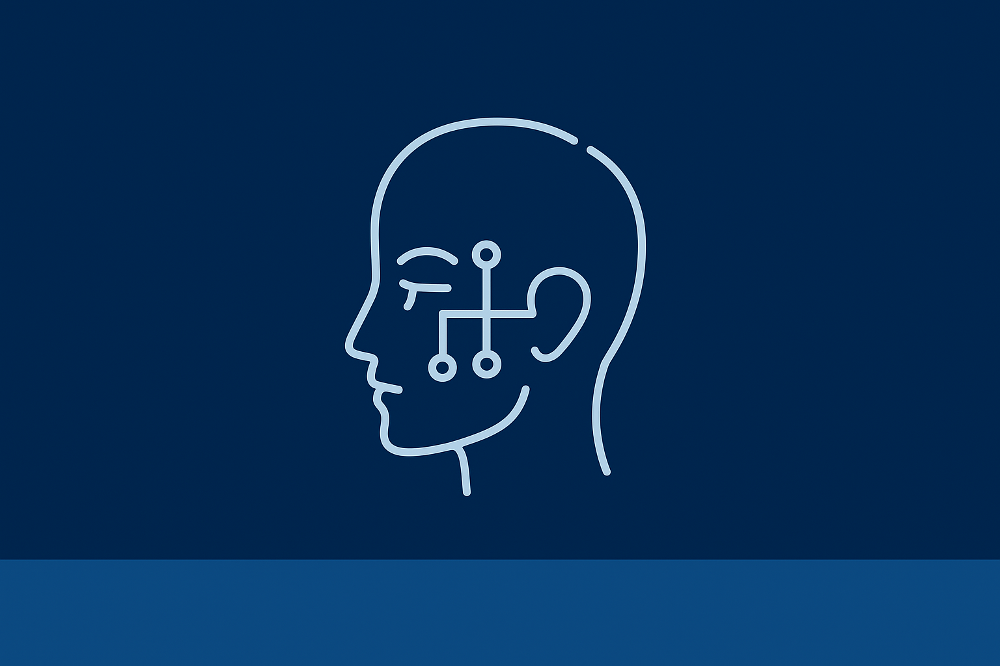

🎓 Realizei mais uma análise de um dilema ético envolvendo Inteligência Artificial, como parte das atividades do meu curso superior em Análise e Desenvolvimento de Sistemas.

O caso escolhido foi o uso de reconhecimento facial, uma tecnologia cada vez mais presente em bancos, redes sociais e até na segurança pública. Embora útil, ela levanta sérias questões éticas:

📌 Principais pontos da análise:

Viés e Justiça: maior taxa de erro ao identificar mulheres, pessoas negras e minorias.

Transparência: sistemas funcionam como “caixas-pretas”, sem clareza sobre por que decisões são tomadas.

Impacto social: risco de vigilância em massa, uso discriminatório e ameaça à privacidade (LGPD).

Governança: falta de regulação específica no Brasil, diferente da União Europeia que avança com o AI Act.

✅ Posicionamento:
O reconhecimento facial não deve ser banido, mas precisa ser reprojetado e regulado para garantir confiança, justiça e respeito aos direitos fundamentais.

🔑 Minhas recomendações:

Auditorias independentes de viés antes da adoção.

Explicabilidade obrigatória, com relatórios públicos.

Regulação alinhada à LGPD e inspirada em boas práticas internacionais.

👉 **Relatório completo:** [link do PDF](./ExperienciaPraticaIII.pdf)