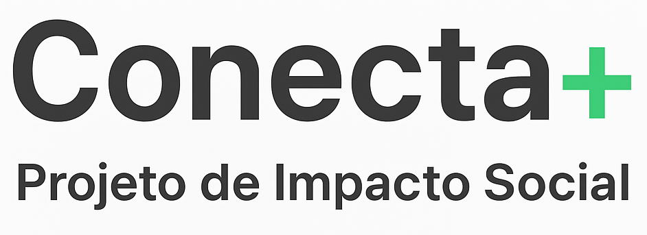

🚀 Chegou o Conecta+

Uma iniciativa de impacto social para reduzir a desigualdade digital no Brasil.
Nosso projeto promove inclusão, acessibilidade e sustentabilidade por meio de uma plataforma que oferece:

✅ Cursos gratuitos de inclusão digital
✅ Acessibilidade total (Libras, leitores de tela, legendas automáticas)
✅ Conteúdo disponível offline para comunidades com internet limitada
✅ Parcerias para inserção no mercado de trabalho

📲 O Conecta+ acredita que tecnologia é um direito de todos e deve ser usada para transformar vidas.

💡 Quer conhecer o projeto completo?
👉 **Relatório completo:** [link do PDF](./ExperienciaPraticaIV.pdf)

Junte-se a nós e ajude a conectar pessoas, sonhos e oportunidades! 🌍💚
